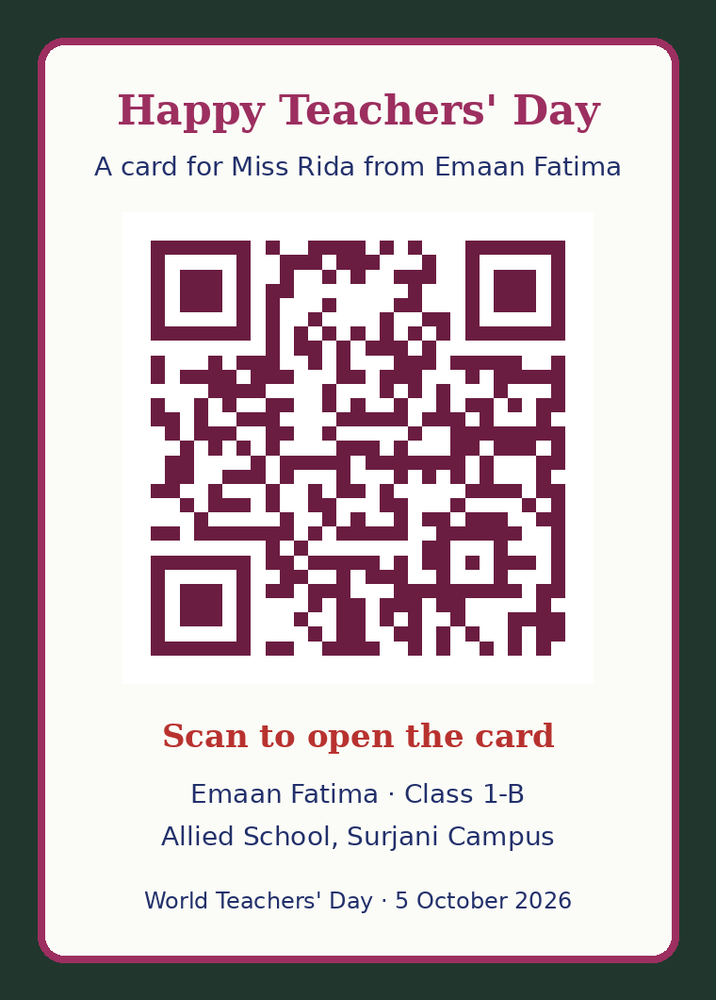

# Teachers' Day Card for Miss Rida

An animated Teachers' Day card from Emaan Fatima (Class 1-B, Allied School, Surjani Campus) to her teacher, Miss Rida.

**Open the card:** https://miss-rida.vercel.app/



## What's inside
- An envelope that opens into a three-page school exercise book
- A handwritten thank-you letter, a "What you taught me" page with teacher's ticks, and a poem
- Swipe left or tap a page to turn it
- Music that changes with each part of the card
- Chalk-star confetti, a gold "Best Teacher" star and a share panel with a QR code

## How it's built
The card is one self-contained file, `public/card.html`. `next.config.ts` serves it at the site root, so Vercel deploys it with the normal Next.js settings.

```bash
npm install
npm run dev
```
